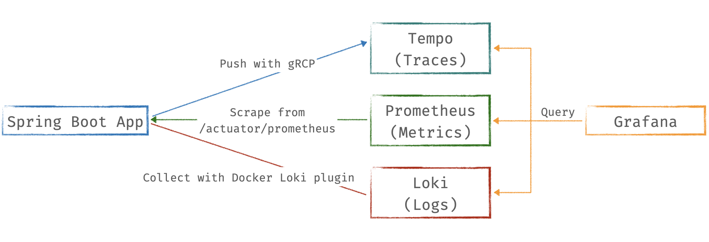

# Spring Boot with Observability

Observe Spring Boot application with three pillars of observability on [Grafana](https://github.com/grafana/grafana):

1. Traces with [Tempo](https://github.com/grafana/tempo) and [OpenTelemetry Instrumentation for Java](https://github.com/open-telemetry/opentelemetry-java-instrumentation)
2. Metrics with [Prometheus](https://prometheus.io/), [Spring Boot Actuator](https://docs.spring.io/spring-boot/docs/current/actuator-api/htmlsingle/), and [Micrometer](https://micrometer.io/)
3. Logs with [Loki](https://github.com/grafana/loki) and [Log4j2](https://logging.apache.org/log4j/2.x/)



This demo project is a Spring Boot version of [FastAPI with Observability](https://github.com/blueswen/fastapi-observability) and is also inspired by [Cloud Observability with Grafana and Spring Boot](https://github.com/qaware/cloud-observability-grafana-spring-boot).

## Quick Start

0. If your machine is Apple Silicon, pull ```linux/arm64/v8``` platform java images with ```pull_arm_images.sh``` first.

1. Install [Loki Docker Driver](https://grafana.com/docs/loki/latest/clients/docker-driver/)

   ```bash
   docker plugin install grafana/loki-docker-driver:latest --alias loki --grant-all-permissions
   ```

2. Build application image and start all services with docker-compose

   ```bash
   docker-compose build
   docker-compose up -d
   ```

3. Send requests with [siege](https://linux.die.net/man/1/siege) to the Spring Boot app

   ```bash
   bash request-script.sh
   bash trace.sh
   ```

4. Check predefined dashboard ```Spring Boot Observability``` on Grafana [http://localhost:3000/](http://localhost:3000/)

   Dashboard screenshot:

   

## Explore with Grafana

Grafana provides a great solution, which could observe specific action in service between traces, metrics, and logs through trace ID and exemplar.


Image Source: [Grafana](https://grafana.com/blog/2021/03/31/intro-to-exemplars-which-enable-grafana-tempos-distributed-tracing-at-massive-scale/)

### Metrics to Traces

Get Trace ID from an exemplar in metrics, then query in Tempo.

Query with ```histogram_quantile(.99,sum(rate(http_server_requests_seconds_bucket{application="app-a", uri!="/actuator/prometheus"}[1m])) by(uri, le))``` and turn on Exemplars in options.


### Traces to Logs

Get Trace ID and tags (here is ```compose.service```) defined in Tempo data source from span, then query with Loki.


### Logs to Traces

Get Trace ID pared from log (regex defined in Loki data source), then query in Tempo.


## Reference

1. [Cloud Observability with Grafana and Spring Boot](https://github.com/qaware/cloud-observability-grafana-spring-boot)
2. [Exemplars support for Prometheus Histogram](https://github.com/micrometer-metrics/micrometer/issues/2812)
3. [OpenTelemetry SDK Autoconfigure](https://github.com/open-telemetry/opentelemetry-java/blob/main/sdk-extensions/autoconfigure/README.md)
