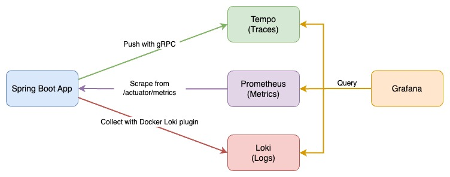
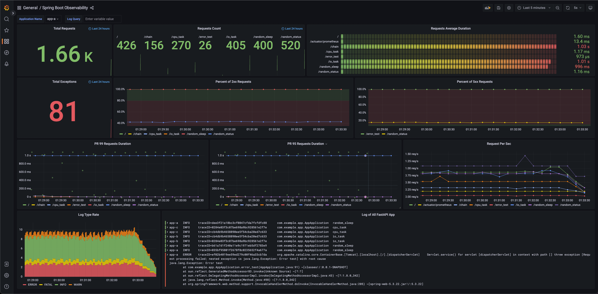
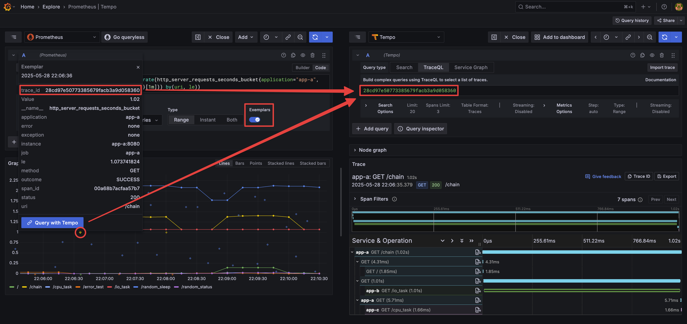
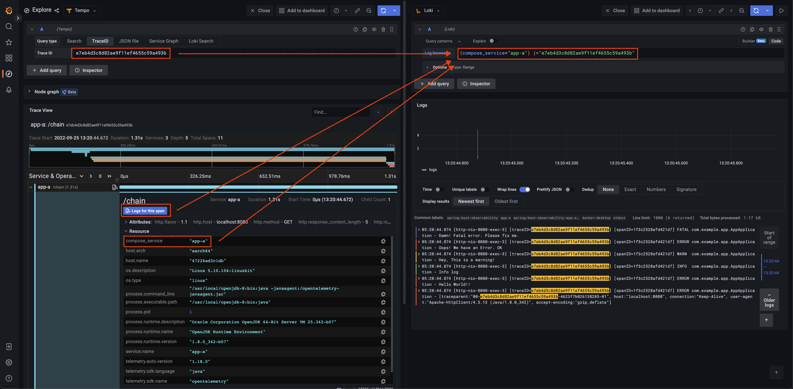
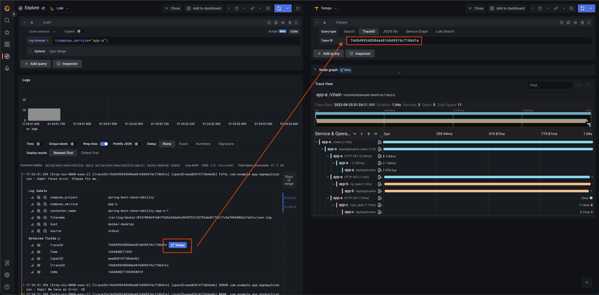
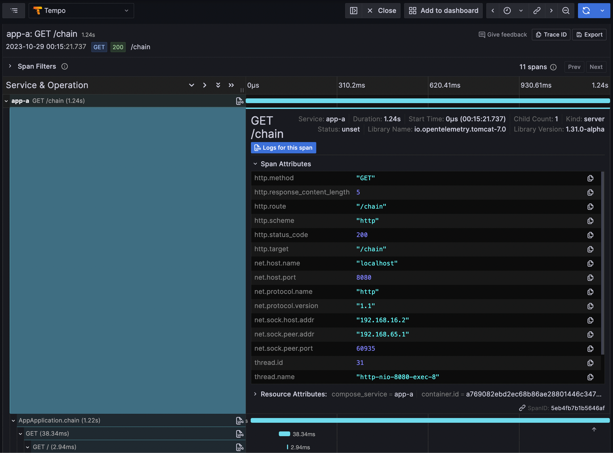
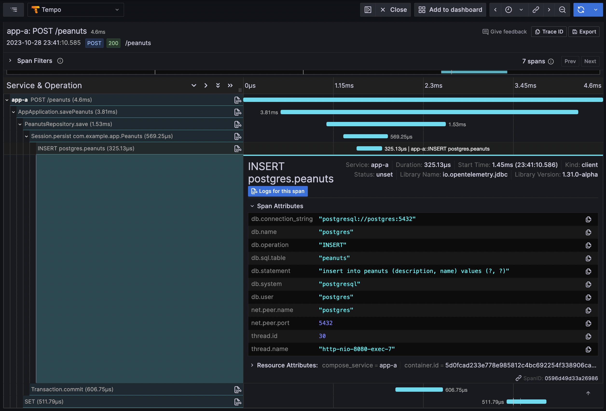
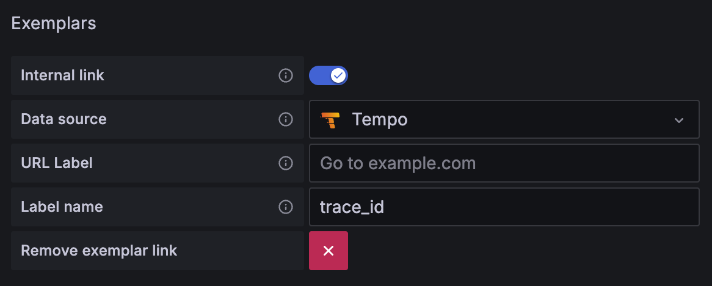
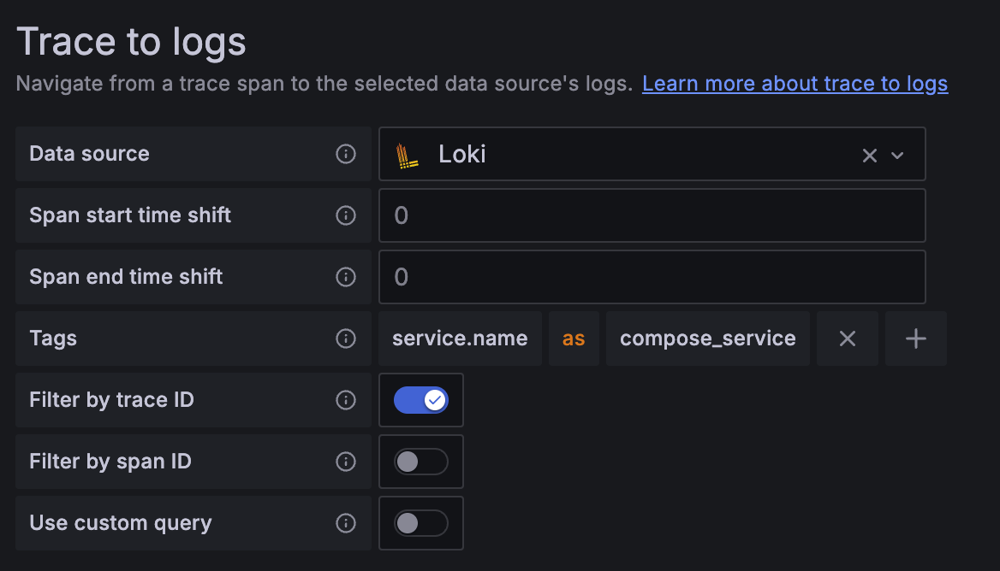
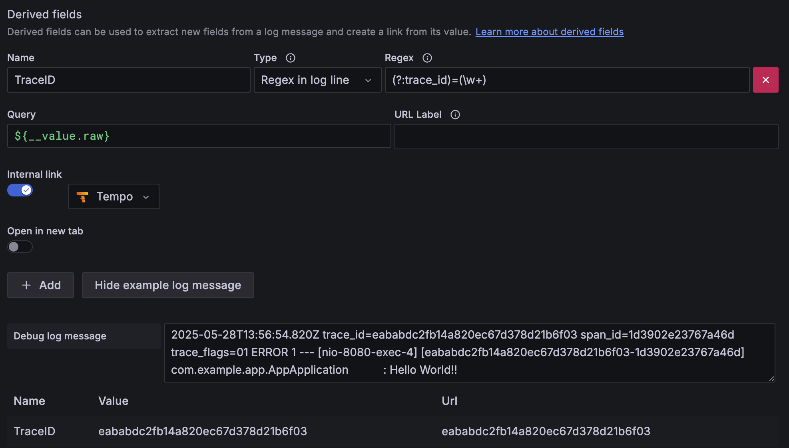

# Spring Boot with Observability

Observe the Spring Boot application with three pillars of observability on [Grafana](https://github.com/grafana/grafana):

1. Traces with [Tempo](https://github.com/grafana/tempo) and [OpenTelemetry Instrumentation for Java](https://github.com/open-telemetry/opentelemetry-java-instrumentation)
2. Metrics with [Prometheus](https://prometheus.io/), [Spring Boot Actuator](https://docs.spring.io/spring-boot/docs/current/actuator-api/htmlsingle/), and [Micrometer](https://micrometer.io/)
3. Logs with [Loki](https://github.com/grafana/loki) and [Logback](https://logback.qos.ch/)



This demo project is a Spring Boot version of [FastAPI with Observability](https://github.com/blueswen/fastapi-observability) and is also inspired by [Cloud Observability with Grafana and Spring Boot](https://github.com/qaware/cloud-observability-grafana-spring-boot).

## Table of contents

- [Spring Boot with Observability](#spring-boot-with-observability)
  - [Table of contents](#table-of-contents)
  - [Quick Start](#quick-start)
  - [Explore with Grafana](#explore-with-grafana)
    - [Metrics to Traces](#metrics-to-traces)
    - [Traces to Logs](#traces-to-logs)
    - [Logs to Traces](#logs-to-traces)
  - [Detail](#detail)
    - [Spring Boot Application](#spring-boot-application)
      - [OpenTelemetry Instrumentation](#opentelemetry-instrumentation)
      - [Logs](#logs)
      - [Traces](#traces)
      - [Metrics](#metrics)
        - [Metrics with Exemplar](#metrics-with-exemplar)
    - [Prometheus - Metrics](#prometheus---metrics)
      - [Prometheus Config](#prometheus-config)
      - [Grafana Data Source](#grafana-data-source)
    - [Tempo - Traces](#tempo---traces)
      - [Grafana Data Source](#grafana-data-source-1)
    - [Loki - Logs](#loki---logs)
      - [Loki Docker Driver](#loki-docker-driver)
      - [Grafana Data Source](#grafana-data-source-2)
    - [Grafana](#grafana)
  - [Reference](#reference)

## Quick Start

1. Install [Loki Docker Driver](https://grafana.com/docs/loki/latest/clients/docker-driver/)

   ```bash
   docker plugin install grafana/loki-docker-driver:latest --alias loki --grant-all-permissions
   ```

2. Start all services with docker-compose

   ```bash
   docker-compose up -d
   ```

3. Send requests with [siege](https://linux.die.net/man/1/siege) and curl to the Spring Boot app

   ```bash
   bash request-script.sh
   bash trace.sh
   ```

   Or you can send requests with [k6](https://k6.io/):

   ```bash
   k6 run --vus 3 --duration 300s k6-script.js
   ```

   Or send requests from applications' Swagger UI:

    - app-a: [http://localhost:8080/swagger-ui/index.html](http://localhost:8080/swagger-ui/index.html)
    - app-b: [http://localhost:8081/swagger-ui/index.html](http://localhost:8081/swagger-ui/index.html)
    - app-c: [http://localhost:8082/swagger-ui/index.html](http://localhost:8082/swagger-ui/index.html)

4. Check predefined dashboard ```Spring Boot Observability``` on Grafana [http://localhost:3000/](http://localhost:3000/) and login with default account ```admin``` and password ```admin```

   Dashboard screenshot:

   

   The dashboard is also available on [Grafana Dashboards](https://grafana.com/grafana/dashboards/17175).

## Explore with Grafana

Grafana provides a great solution, which could observe specific actions in service between traces, metrics, and logs through trace ID and exemplar.


Image Source: [Grafana](https://grafana.com/blog/2021/03/31/intro-to-exemplars-which-enable-grafana-tempos-distributed-tracing-at-massive-scale/)

### Metrics to Traces

Get Trace ID from an exemplar in metrics, then query in Tempo.

Query with ```histogram_quantile(.99,sum(rate(http_server_requests_seconds_bucket{application="app-a", uri!="/actuator/prometheus"}[1m])) by(uri, le))``` and turn on Exemplars in options.



### Traces to Logs

Get Trace ID and tags (here is `compose.service`) defined in Tempo data source from span, then query with Loki.



### Logs to Traces

Get Trace ID from log (regex defined in Loki data source), then query in Tempo.



## Detail

### Spring Boot Application

For a more complex scenario, we use three Spring Boot applications with the same code in this demo. There is a cross-service action in `/chain` endpoint, which provides a good example of how OpenTelemetry Instrumentation work and how Grafana presents trace information.

#### OpenTelemetry Instrumentation

[OpenTelemetry Instrumentation for Java](https://github.com/open-telemetry/opentelemetry-java-instrumentation) provides an [automatic way](https://opentelemetry.io/docs/instrumentation/java/automatic/) to instrument the application by the agent jar as follows:

```bash
java -javaagent:path/to/opentelemetry-javaagent.jar -jar myapp.jar
```

The agent supports a lot of [libraries](https://github.com/open-telemetry/opentelemetry-java-instrumentation/blob/main/docs/supported-libraries.md), including Spring Web MVC. According to the document:

> It can be used to capture telemetry data at the “edges” of an app or service, such as inbound requests, outbound HTTP calls, database calls, and so on.

So we don't need to modify any line of code in our codebase. The agent will handle everything automatically. In this project, we have three kinds of actions that could be captured by the agent:

1. HTTP requests: capture HTTP information like request method, status, and so on.
   
    
   
2. PostgreSQL actions(POST `/peanuts` and the first request of GET `/peanuts/{id}`): capture DB information like SQL statement, table name, and so on. 

    
   
3. Redis commands(From the second request of GET `/peanuts/{id}`): capture Redis information like commands, keys, and so on.

    

The configurations, like the exporter setting, are listed on the [document](https://github.com/open-telemetry/opentelemetry-java/tree/main/sdk-extensions/autoconfigure), and are consumed by the agent from one or more of the following sources (ordered from highest to lowest priority):

- system properties
- environment variables
- the configuration file
- the [ConfigPropertySource](https://github.com/open-telemetry/opentelemetry-java/tree/main/sdk-extensions/autoconfigure#customizing-the-opentelemetry-sdk) SPI

In this demo project we use environment variables to set the agent configuration:

```yaml
app-a:
  build: ./app/
  environment:
    - OTEL_EXPORTER_OTLP_ENDPOINT=http://tempo:4317
    - OTEL_SERVICE_NAME=app-a
    - OTEL_RESOURCE_ATTRIBUTES=compose_service=app-a
    - OTEL_METRICS_EXPORTER=none
  ports:
    - "8080:8080"
```

Or using a configuration file is another common way to set the agent:

```properties
# otel.properties
otel.exporter.otlp.endpoint=http://tempo:4317
otel.service.name=app-a
otel.resource.attributes=compose_service=app-a
otel.metrics.exporter=none
```

```bash
# set otel.javaagent.configuration-file with system properties
java -javaagent:path/to/opentelemetry-javaagent.jar \
     -Dotel.javaagent.configuration-file=path/to/otel.properties \
     -jar myapp.jar
```

More configuration details can be found on the [official document](https://opentelemetry.io/docs/instrumentation/java/automatic/agent-config/).

#### Logs

OpenTelemetry Agent will add information to each logging automatically.

> OpenTelemetry Agent injects the current span information into each logging event's MDC copy:
> - trace_id - the current trace id (same as Span.current().getSpanContext().getTraceId());
> - span_id - the current span id (same as Span.current().getSpanContext().getSpanId());
> - trace_flags - the current trace flags, formatted according to W3C traceflags format (same as Span.current().getSpanContext().getTraceFlags().asHex()).

[Logger MDC auto-instrumentation](https://github.com/open-telemetry/opentelemetry-java-instrumentation/blob/main/docs/logger-mdc-instrumentation.md)

In this demo project, we override `logging.pattern.level` in `application.yaml` file:

```yaml
logging:
  pattern:
    level: "trace_id=%mdc{trace_id} span_id=%mdc{span_id} trace_flags=%mdc{trace_flags} %p"
```

The log would be like this:

```log
2022-10-10 15:18:54.893 trace_id=605c7adf03bdb2f2917206de1eae8f72 span_id=c581b882e2d252c2 trace_flags=01 ERROR 1 --- [nio-8080-exec-6] com.example.app.AppApplication           : Hello World!!
```

#### Traces

As previously mentioned, OpenTelemetry Agent can capture telemetry data at the “edges” of an app or service, such as inbound requests, and outbound HTTP calls. We don't need to add anything to our code. To show this, we provide the `/chain` endpoint in the application as follows:

```java
@GetMapping("/chain")
    public String chain(@RequestParam(value = "name", defaultValue = "World") String name) throws InterruptedException, IOException {
        String TARGET_ONE_HOST = System.getenv().getOrDefault("TARGET_ONE_HOST", "localhost");
        String TARGET_TWO_HOST = System.getenv().getOrDefault("TARGET_TWO_HOST", "localhost");
        logger.debug("chain is starting");
        Request.Get("http://localhost:8080/")
                .execute().returnContent();
        Request.Get(String.format("http://%s:8080/io_task", TARGET_ONE_HOST))
                .execute().returnContent();
        Request.Get(String.format("http://%s:8080/cpu_task", TARGET_TWO_HOST))
                .execute().returnContent();
        logger.debug("chain is finished");
        return "chain";
    }
```

When calling app-a `chain` endpoint(`curl localhost:8080/chain`), it will send requests to itself root(`/`) and the other two services' `io_task`, and `cpu_task` by order. In the whole process, we don't write any line of code about OpenTelemetry, trace, or span. But the log shows all inbound requests, and outbound HTTP calls were added span information as follows: 

```log
# Start from app-a chain
2022-10-10 15:57:12.828 trace_id=743ae05db90d00fd65998ff30cf7094d span_id=6cc84ac5ed4cf68c trace_flags=01 DEBUG 1 --- [nio-8080-exec-6] com.example.app.AppApplication           : chain is starting

# In app-a root
2022-10-10 15:57:13.106 trace_id=743ae05db90d00fd65998ff30cf7094d span_id=4745d1a1f588a949 trace_flags=01 ERROR 1 --- [nio-8080-exec-7] com.example.app.AppApplication           : [traceparent:"00-743ae05db90d00fd65998ff30cf7094d-d72a1422522ce837-01", host:"localhost:8080", connection:"Keep-Alive", user-agent:"Apache-HttpClient/4.5.13 (Java/1.8.0_342)", accept-encoding:"gzip,deflate"]
2022-10-10 15:57:13.106 trace_id=743ae05db90d00fd65998ff30cf7094d span_id=4745d1a1f588a949 trace_flags=01 ERROR 1 --- [nio-8080-exec-7] com.example.app.AppApplication           : Hello World!!
2022-10-10 15:57:13.106 trace_id=743ae05db90d00fd65998ff30cf7094d span_id=4745d1a1f588a949 trace_flags=01 DEBUG 1 --- [nio-8080-exec-7] com.example.app.AppApplication           : Debugging log
2022-10-10 15:57:13.106 trace_id=743ae05db90d00fd65998ff30cf7094d span_id=4745d1a1f588a949 trace_flags=01 INFO 1 --- [nio-8080-exec-7] com.example.app.AppApplication           : Info log
2022-10-10 15:57:13.106 trace_id=743ae05db90d00fd65998ff30cf7094d span_id=4745d1a1f588a949 trace_flags=01 WARN 1 --- [nio-8080-exec-7] com.example.app.AppApplication           : Hey, This is a warning!
2022-10-10 15:57:13.106 trace_id=743ae05db90d00fd65998ff30cf7094d span_id=4745d1a1f588a949 trace_flags=01 ERROR 1 --- [nio-8080-exec-7] com.example.app.AppApplication           : Oops! We have an Error. OK

# In app-b io_task
2022-10-10 15:57:14.141 trace_id=743ae05db90d00fd65998ff30cf7094d span_id=b97df0b1834ab84a trace_flags=01 INFO 1 --- [nio-8080-exec-4] com.example.app.AppApplication           : io_task

# In app-c cpu_task
2022-10-10 15:57:14.191 trace_id=743ae05db90d00fd65998ff30cf7094d span_id=7fd693eefc0d3387 trace_flags=01 INFO 1 --- [nio-8080-exec-4] com.example.app.AppApplication           : cpu_task

# Back to app-a chain
2022-10-10 15:57:14.199 trace_id=743ae05db90d00fd65998ff30cf7094d span_id=6cc84ac5ed4cf68c trace_flags=01 DEBUG 1 --- [nio-8080-exec-6] com.example.app.AppApplication           : chain is finished
```

Each endpoint got the same trace_id `743ae05db90d00fd65998ff30cf7094d` start from app-a `chain`. The auto-injected `traceparent`(could saw in the first line in app-a root log) is how OpenTelemetry Agent passed through all these services.

#### Metrics

To get Prometheus metrics from the Spring Boot application, we need two dependencies:

1. [Spring Boot Actuator](https://github.com/spring-projects/spring-boot/tree/v2.7.4/spring-boot-project/spring-boot-actuator): Actuator provides a lot of monitoring features by HTTP or JMX endpoints for the Spring Boot applications.
2. [Micrometer](https://github.com/micrometer-metrics/micrometer): Micrometer provides a general API to collect metrics and transform the format for different monitoring systems, including Prometheus.

Add these two dependencies to the `pom.xml` and config to the `application.yaml` as follows:

```xml
<dependency>
   <groupId>org.springframework.boot</groupId>
   <artifactId>spring-boot-starter-actuator</artifactId>
</dependency>
<dependency>
   <groupId>io.micrometer</groupId>
   <artifactId>micrometer-registry-prometheus</artifactId>
</dependency>
```

```yaml
management:
  endpoints:
    web:
      exposure:
        include: prometheus # only exposure /actuator/prometheus endpoint
  metrics:
    tags:
      application: app # add tag to each prometheus metric
```

The Prometheus metrics look like this on `/actuator/prometheus`:

```txt
# HELP executor_active_threads The approximate number of threads that are actively executing tasks
# TYPE executor_active_threads gauge
executor_active_threads{application="app",name="applicationTaskExecutor",} 0.0
...
 HELP http_server_requests_seconds Duration of HTTP server request handling
# TYPE http_server_requests_seconds summary
http_server_requests_seconds_count{application="app",exception="None",method="GET",outcome="SUCCESS",status="200",uri="/",} 1.0
http_server_requests_seconds_sum{application="app",exception="None",method="GET",outcome="SUCCESS",status="200",uri="/",} 0.047062542
http_server_requests_seconds_count{application="app",exception="None",method="GET",outcome="SUCCESS",status="200",uri="/actuator/prometheus",} 2.0
http_server_requests_seconds_sum{application="app",exception="None",method="GET",outcome="SUCCESS",status="200",uri="/actuator/prometheus",} 0.053801375
# HELP http_server_requests_seconds_max Duration of HTTP server request handling
# TYPE http_server_requests_seconds_max gauge
http_server_requests_seconds_max{application="app",exception="None",method="GET",outcome="SUCCESS",status="200",uri="/",} 0.047062542
http_server_requests_seconds_max{application="app",exception="None",method="GET",outcome="SUCCESS",status="200",uri="/actuator/prometheus",} 0.045745625
...
```

##### Metrics with Exemplar

Exemplar is a new datatype proposed in [OpenMetrics](https://github.com/OpenObservability/OpenMetrics/blob/main/specification/OpenMetrics.md#exemplars). To enable the Exemplar feature there are some dependencies requirements:

1. Spring Boot >= 2.7.0: Spring Boot supported Prometheus Exemplars since [v2.7.0-RC1](https://github.com/spring-projects/spring-boot/releases/tag/v2.7.0-RC1).
2. Micrometer >= 1.10.0: Micrometer supported Exemplar for Prometheus Histogram and Prometheus Counter since [1.9.0](https://github.com/micrometer-metrics/micrometer/releases/tag/v1.9.0) and using io.prometheus.simpleclient_common 0.16.0 since [1.10.0](https://mvnrepository.com/artifact/io.micrometer/micrometer-registry-prometheus/1.10.0).

Additionally, we need to add an [Exemplar Sampler](app/src/main/java/com/example/app/PrometheusExemplarSamplerConfiguration.java) (Source from [qaware/cloud-observability-grafana-spring-boot](https://github.com/qaware/cloud-observability-grafana-spring-boot/blob/b331b87b1a7f0f5b5d57150e0356e6a26af967a2/spring-boot-app/src/main/java/de/qaware/demo/cloudobservability/PrometheusExemplarSamplerConfiguration.java)) as follows:

```java
package com.example.app;

import io.prometheus.client.exemplars.tracer.otel_agent.OpenTelemetryAgentSpanContextSupplier;
import org.springframework.context.annotation.Bean;
import org.springframework.context.annotation.Configuration;

@Configuration
public class PrometheusExemplarSamplerConfiguration {
    @Bean
    public OpenTelemetryAgentSpanContextSupplier openTelemetryAgentSpanContextSupplier() {
        // OpenTelemetryAgentSpanContextSupplier is from the opentelemetry agent jar, without using the agent will cause class not found error when running.
        return new OpenTelemetryAgentSpanContextSupplier();
    }
}
```

The discussion about Exemplar Sampler is in [Exemplars support for Prometheus Histogram #2812](https://github.com/micrometer-metrics/micrometer/issues/2812#issuecomment-1086001766) on the Micrometer repository.

When all dependencies are addressed. We can add a distribution metric to Prometheus metrics in the `application.yaml`.

```yaml
management:
  metrics:
    distribution:
      percentiles-histogram:
        http:
          server:
            requests: 'true'
```

Check more options for distribution metrics on the [Spring Boot document](https://docs.spring.io/spring-boot/docs/2.7.3/reference/html/actuator.html#actuator.metrics.customizing.per-meter-properties).

As previously mentioned, Exemplar is a new datatype proposed in OpenMetrics, and the default `/actuator/prometheus` provide metrics with Prometheus format. So we need to [add some headers](https://docs.spring.io/spring-boot/docs/current/actuator-api/htmlsingle/#prometheus.retrieving:~:text=The%20default%20response%20content%20type%20is%20text/plain%3Bversion%3D0.0.4.%20The%20endpoint%20can%20also%20produce%20application/openmetrics%2Dtext%3Bversion%3D1.0.0%20when%20called%20with%20an%20appropriate%20Accept%20header%2C%20as%20shown%20in%20the%20following%20curl%2Dbased%20example%3A) to get the metrics with OpenMetrics format as follows:

```bash
curl 'http://localhost:8080/actuator/prometheus' -i -X GET \
   -H 'Accept: application/openmetrics-text; version=1.0.0; charset=utf-8'
```

The histogram metrics with trace ID (starts with `#`) look like this:

```txt
# TYPE http_server_requests_seconds histogram
# HELP http_server_requests_seconds Duration of HTTP server request handling
http_server_requests_seconds_bucket{application="app",exception="None",method="GET",outcome="SUCCESS",status="200",uri="/",le="0.001"} 0.0
http_server_requests_seconds_bucket{application="app",exception="None",method="GET",outcome="SUCCESS",status="200",uri="/",le="0.001048576"} 0.0
http_server_requests_seconds_bucket{application="app",exception="None",method="GET",outcome="SUCCESS",status="200",uri="/",le="0.001398101"} 0.0
http_server_requests_seconds_bucket{application="app",exception="None",method="GET",outcome="SUCCESS",status="200",uri="/",le="0.001747626"} 0.0
http_server_requests_seconds_bucket{application="app",exception="None",method="GET",outcome="SUCCESS",status="200",uri="/",le="0.002097151"} 0.0
http_server_requests_seconds_bucket{application="app",exception="None",method="GET",outcome="SUCCESS",status="200",uri="/",le="0.002446676"} 0.0
http_server_requests_seconds_bucket{application="app",exception="None",method="GET",outcome="SUCCESS",status="200",uri="/",le="0.002796201"} 1.0 # {span_id="55255da260e873d9",trace_id="21933703cb442151b1cef583714eb42e"} 0.002745959 1665676383.654
http_server_requests_seconds_bucket{application="app",exception="None",method="GET",outcome="SUCCESS",status="200",uri="/",le="0.003145726"} 1.0
http_server_requests_seconds_bucket{application="app",exception="None",method="GET",outcome="SUCCESS",status="200",uri="/",le="0.003495251"} 2.0 # {span_id="81222a08c4f050fe",trace_id="eddcd9569d20b4aa48c06d3b905f32ea"} 0.003224625 1665676382.620
```

### Prometheus - Metrics

Collects metrics from applications.

#### Prometheus Config

Define all Spring Boot applications metrics scrape jobs in `etc/prometheus/prometheus.yml`.

Prometheus will scrape OpenMetrics format metrics automatically, there is no need to add specific headers config when scraping from `/actuator/prometheus`.

```yaml
...
scrape_configs:
  - job_name: 'app-a'
    scrape_interval: 5s
    metrics_path: "/actuator/prometheus"
    static_configs:
      - targets: ['app-a:8080']

  - job_name: 'app-b'
    scrape_interval: 5s
    metrics_path: "/actuator/prometheus"
    static_configs:
      - targets: ['app-b:8080']

  - job_name: 'app-c'
    scrape_interval: 5s
    metrics_path: "/actuator/prometheus"
    static_configs:
      - targets: ['app-c:8080']
```

#### Grafana Data Source

Add an Exemplars which uses the value of `TraceID` label to create a Tempo link.

Grafana data source setting example:



Grafana data sources config example:

```yaml
name: Prometheus
type: prometheus
typeName: Prometheus
access: proxy
url: http://prometheus:9090
password: ''
user: ''
database: ''
basicAuth: false
isDefault: true
jsonData:
exemplarTraceIdDestinations:
   - datasourceUid: tempo
      name: TraceID
httpMethod: POST
readOnly: false
editable: true
```

### Tempo - Traces

Receives spans from applications.

#### Grafana Data Source

[Trace to logs](https://grafana.com/docs/grafana/latest/datasources/tempo/#trace-to-logs) setting:

1. Data source: target log source
2. Tags: key of tags or process level attributes from the trace, which will be log query criteria if the key exists in the trace
3. Map tag names: Convert existing key of tags or process level attributes from trace to another key, then used as log query criteria. Use this feature when the values of the trace tag and log label are identical but the keys are different.

Grafana data source setting example:



Grafana data sources config example:

```yaml
name: Tempo
type: tempo
typeName: Tempo
access: proxy
url: http://tempo
password: ''
user: ''
database: ''
basicAuth: false
isDefault: false
jsonData:
nodeGraph:
   enabled: true
tracesToLogs:
   datasourceUid: loki
   filterBySpanID: false
   filterByTraceID: true
   mapTagNamesEnabled: false
   tags:
      - compose_service
readOnly: false
editable: true
```

### Loki - Logs

Collects logs with Loki Docker Driver from all services.

#### Loki Docker Driver

1. Use [YAML anchor and alias](https://support.atlassian.com/bitbucket-cloud/docs/yaml-anchors/) feature to set logging options for each service.
2. Set [Loki Docker Driver options](https://grafana.com/docs/loki/latest/clients/docker-driver/configuration/)
   1. loki-url: loki service endpoint
   2. loki-pipeline-stages: processes multiline log from Spring Boot application with multiline and regex stages ([reference](https://grafana.com/docs/loki/latest/clients/promtail/stages/multiline/))

```yaml
x-logging: &default-logging # anchor(&): 'default-logging' for defines a chunk of configuration
  driver: loki
  options:
    loki-url: 'http://localhost:3100/api/prom/push'
    loki-pipeline-stages: |
      - multiline:
          firstline: '^\d{4}-\d{2}-\d{2} \d{1,2}:\d{2}:\d{2}'
          max_wait_time: 3s
      - regex:
          expression: '^(?P<time>\d{4}-\d{2}-\d{2} \d{1,2}:\d{2}:\d{2},d{3}) (?P<message>(?s:.*))$$'
# Use $$ (double-dollar sign) when your configuration needs a literal dollar sign.

version: "3.4"

services:
   foo:
      image: foo
      logging: *default-logging # alias(*): refer to 'default-logging' chunk 
```

#### Grafana Data Source

Add a TraceID derived field to extract the trace id and create a Tempo link from the trace id.

Grafana data source setting example:



Grafana data source config example:

```yaml
name: Loki
type: loki
typeName: Loki
access: proxy
url: http://loki:3100
password: ''
user: ''
database: ''
basicAuth: false
isDefault: false
jsonData:
derivedFields:
   - datasourceUid: tempo
      matcherRegex: (?:trace_id)=(\w+)
      name: TraceID
      url: $${__value.raw}
      # Use $$ (double-dollar sign) when your configuration needs a literal dollar sign.
readOnly: false
editable: true
```

### Grafana

1. Add Prometheus, Tempo, and Loki to the data source with config file `etc/grafana/datasource.yml`.
2. Load predefined dashboard with `etc/dashboards.yaml` and `etc/dashboards/spring-boot-observability.json`.

```yaml
# grafana in docker-compose.yaml
grafana:
   image: grafana/grafana:9.4.3
   volumes:
      - ./etc/grafana/:/etc/grafana/provisioning/datasources # data sources
      - ./etc/dashboards.yaml:/etc/grafana/provisioning/dashboards/dashboards.yaml # dashboard setting
      - ./etc/dashboards:/etc/grafana/dashboards # dashboard json files directory
```

## Reference

1. [Cloud Observability with Grafana and Spring Boot](https://github.com/qaware/cloud-observability-grafana-spring-boot)
2. [Exemplars support for Prometheus Histogram](https://github.com/micrometer-metrics/micrometer/issues/2812)
3. [OpenTelemetry SDK Autoconfigure](https://github.com/open-telemetry/opentelemetry-java/blob/main/sdk-extensions/autoconfigure/README.md)
4. [Java system properties and environment variables](https://stackoverflow.com/questions/7054972/java-system-properties-and-environment-variables)
